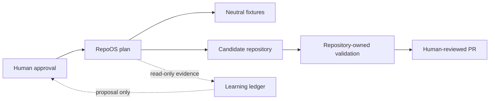

# Validated RepoOS architecture

Status: authoritative Phase 2 implementation plan
Validated: 2026-07-23

## Outcome

RepoOS is a small, deterministic control plane for inspecting, validating, planning, and—only after explicit approval—updating independently owned repositories. It is not a monorepo parent, runtime dependency, static template copier, autonomous agent service, or organization-governance controller.

The architecture keeps the Phase 1 four-layer model with local-evidence constraints:

1. **User-global Codex:** universal preferences and explicitly approved reusable assets. RepoOS may render, validate, diff, back up, and dry-run these components, but this run performs no home-directory installation.
2. **RepoOS control plane:** versioned schemas, component metadata, CLI, neutral fixtures, public-safe registry, learning records, and CI.
3. **Family/capability overlays:** ordered, versioned components with deterministic eligibility. None is created until at least two confirmed consumers exist.
4. **Repository-local:** product behavior, business rules, architecture, authoritative commands, secrets policy, local instructions, exceptions, and files not explicitly adopted.

Unknown ownership always resolves to repository-owned.

## Trust boundaries

- Discovery, inventory, validation, diff, audit, and reporting are read-only.
- A plan is data, not authorization.
- Apply requires an explicit repository, clean Git state, lock, fresh plan validation, backup, maximum-change limits, and an explicit execute switch.
- Apply never commits, pushes, opens a PR, merges, or changes GitHub settings.
- AI may summarize or propose; it cannot approve, enforce, apply, or promote.
- Downstream and user-global writes are separate authorization domains.

## Public/private evidence split

RepoOS is public. Committed registry and reports therefore use stable aliases, redacted private paths/remotes/SHAs, and publishability labels. Exact mappings, raw Git porcelain, logs, secrets, databases, and private project content remain local and ignored or outside the repository.

Redaction is part of the evidence pipeline, not a post-publication cleanup step. A record that cannot be proven public-safe is not committed.

## Version and state

- RepoOS follows SemVer beginning at `0.1.0`.
- YAML is used for reviewed desired state.
- JSON is used for generated locks, plans, reports, and deterministic evidence.
- JSONL may be used for append-only local ingestion later.
- Caches, locks, and operation journals live outside managed repositories by default.
- A repository declares desired adoption in `.repoos/project.yaml`.
- A generated lock is deferred until release artifact integrity and rollback retention are implemented.

## Ownership model

Initial support:

- fully managed files;
- generated files;
- repository-owned files;
- repository-owned extensions;
- explicit local overrides;
- excluded files.

Managed sections are deferred. No concrete inventory case justifies their corruption and parser risk. If introduced later, v1 support is limited to a specified text format with unique, nonnested markers and byte-preservation tests.

## Minimum viable implementation

The first foundation includes:

- explicit version and package metadata;
- public-safe project registry plus schema;
- manifest, observation, candidate, adoption, and update-plan schemas;
- deterministic CLI help, discovery, inventory, status, doctor, validation, diff, audit, update checking, planning, dry-run apply, and reporting;
- path containment, redaction, Git safety, pause, lock, plan, backup, and rollback primitives exercised only on fixtures;
- repaired RepoOS-local Codex surfaces;
- GitHub-hosted read-only CI pinned to full SHAs;
- neutral unit, integration, schema, security, and CLI fixtures;
- Git-tracked learning directories and recurring read-only workflow specifications.

## Explicitly deferred

- real family/capability overlays;
- user-global installation;
- release signing/publication and content-addressed baseline service;
- organization rulesets, required workflows, variables, secrets, apps, or runners;
- self-hosted runners;
- AI semantic review and automatic promotion;
- SQLite/service/API/dashboard/event bus/vector database;
- broad portfolio rollout;
- downstream canary writes until explicit confirmation.

## Authority

This document supersedes repository-dependent assumptions in the Phase 1 packet. The schemas and shipped code control machine behavior; this document controls architecture; repository-local instructions control target-specific behavior.
