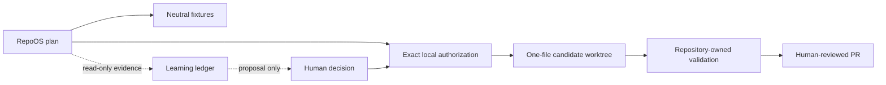

# Validated RepoOS architecture

Status: authoritative Phase 2 architecture plus guarded-bootstrap extension
Validated: 2026-07-23
Updated: 2026-07-25

## Outcome

RepoOS is a small, deterministic control plane for inspecting, validating, planning, and—only after explicit approval—updating independently owned repositories. It is not a monorepo parent, runtime dependency, static template copier, autonomous agent service, or organization-governance controller.

The architecture keeps the Phase 1 four-layer model with local-evidence constraints:

1. **User-global Codex:** universal preferences and explicitly approved reusable assets. RepoOS may render, validate, diff, back up, and dry-run these components, but this run performs no home-directory installation.
2. **RepoOS control plane:** versioned schemas, component metadata, CLI, neutral fixtures, public-safe registry, learning records, and CI.
3. **Family/capability overlays:** ordered, versioned components with deterministic eligibility. None is created until at least two confirmed consumers exist.
4. **Repository-local:** product behavior, business rules, architecture, authoritative commands, secrets policy, local instructions, exceptions, and files not explicitly adopted.

Unknown ownership always resolves to repository-owned.

## Trust boundaries



- Discovery, inventory, validation, diff, audit, and reporting are read-only.
- A plan is data, not authorization.
- Apply requires an explicit repository, clean Git state, lock, fresh plan validation, backup, maximum-change limits, and an explicit execute switch.
- Apply never commits, pushes, opens a PR, merges, or changes GitHub settings.
- AI may summarize or propose; it cannot approve, enforce, apply, or promote.
- Downstream and user-global writes are separate authorization domains.

## Public/private evidence split

RepoOS is public. Committed registry and reports therefore use stable aliases, redacted private paths/remotes/SHAs, and publishability labels. Exact mappings, raw Git porcelain, logs, secrets, databases, and private project content remain local and ignored or outside the repository.

Redaction is part of the evidence pipeline, not a post-publication cleanup step. A record that cannot be proven public-safe is not committed.

## Version and state

- RepoOS follows SemVer beginning at `0.1.0`.
- YAML is used for reviewed desired state.
- JSON is used for generated locks, plans, reports, and deterministic evidence.
- JSONL may be used for append-only local ingestion later.
- Caches, locks, and operation journals live outside managed repositories by default.
- A repository declares desired adoption in `.repoos/project.yaml`.
- Update-plan schema v2 remains immutable by canonical digest and binds the exact fixture path,
  common Git identity, HEAD, status, source root/files, target files, manifest, components,
  ownership, validation commands, and configurable fixture safety measurements.
- Manifest-bootstrap plan v1 is a separate immutable contract. It binds one real target worktree,
  common Git identity, branch/HEAD/cleanliness, content-free sibling summaries, common-Git
  metadata, exact manifest bytes, absent destination/parent state, fixed limits, validation, and
  exact authorization fields.
- Manifest-bootstrap authorization v1 is local, expiring, one-use evidence bound to the exact
  operation, target worktree/common Git directory, branch, HEAD, plan, manifest, and destination.
- Transaction, backup, and public-safe observation schemas version operation state independently
  from the package. An adoption/release lock remains deferred until release artifact integrity and
  long-term rollback retention are implemented.

## Transaction boundary

### Gate reconciliation

Before `0.3.0`, real repositories were refused because `build_update_plan` required a regular
`.repoos-fixture` marker. `precondition_failures` repeated that marker check during dry run and
apply, and fixture rollback checked it again. Thus enforcement existed at planning, application,
and rollback; fixture classification was marker plus a schema-valid manifest permitting apply.

Update-plan v2 had exact roots/common-Git/HEAD/status/manifest/operations but no operation kind,
target branch, sibling preservation model, authorization binding, or explicit absent-manifest/
parent contract. RepoOS therefore preserves it unchanged. The executable plan version now
distinguishes target paths: `repoos.update-plan.v2` maps to `fixture_update`, while
`repoos.manifest-bootstrap-plan.v1` requires `operation_kind: manifest_bootstrap`. Transaction and
backup records carry that operation kind. No generic real-repository target flag exists.

RepoOS `0.3.0` has two disjoint executable paths:

1. update-plan v2 may mutate only a marked disposable fixture whose manifest permits apply;
2. `manifest_bootstrap` may create only an absent `.repoos/project.yaml` in one clean real
   worktree when an exact one-use authorization is valid.

Every other real-repository operation is refused. A fixture marker does not authorize onboarding,
and a bootstrap receipt does not authorize overlays, component updates, commit, push, GitHub, or a
second transaction.

The deterministic state path is:

```text
planned → validated → locked → backed_up → applying → applied
        → validating → completed
                      ↘ rolling_back → rolled_back
                                      ↘ rollback_failed
```

Early failures terminate as `failed`. Invalid transitions are rejected. A schema-valid failed
attempt is recorded before target writes; dry-run creates neither transaction state nor target
state.

The engine holds a per-common-Git filesystem lock for the write/validation/rollback interval.
Process-visible metadata records PID, hostname, start time, target, transaction, and lock kind.
Stale or malformed locks are never removed implicitly; an explicit recovery flag preserves the
prior lock record before acquisition. A short-lived global lock serializes state-wide stale-lock
recovery without preventing ordinary operations on different fixtures.

Before the first target write, RepoOS creates and validates an atomically finalized
operation-specific backup beneath local state. Fixture backups store only original bytes/modes of
approved paths. Bootstrap backups record destination absence, parent state, target Git state,
plan/authorization/manifest digests, and protected sibling/common-Git summaries.

Bootstrap renders and validates outside the destination, atomically installs without overwrite,
validates installed bytes/mode/schema, runs bounded no-shell repository commands, and proves
target/sibling/common-Git preservation. The common Git lock serializes sibling worktrees, but only
the explicit target is writable. Dirty siblings are classified as protected using hashes/counts;
file bodies and untracked names are not persisted. Locked, prunable, malformed, duplicate, or
drifting registrations fail closed.

Validation failure automatically restores transaction-owned state. Bootstrap rollback removes
the created manifest and only a transaction-created parent that remains empty. Manual rollback is
integrity checked, lock protected, drift aware, idempotent, and never uses Git cleanup.
`rollback_failed` is terminal.

Fixture safety limits remain configurable and may have exact recorded overrides. Bootstrap limits
are fixed: one create, zero edits/deletes, exact destination, 64-KiB YAML bound, mode `0644`, no
symlink/traversal/submodule/bare/detached/dirty target, and no generic force or override.

## Ownership model

Executable ownership:

- fully managed files;
- generated files;
- repository-owned files;
- repository-owned extensions;
- explicit local overrides;
- excluded files.
- one `adoption_manifest` creation for the absent real-worktree manifest.

Managed sections are supported only by the fixture engine for UTF-8 text, one operation per
file, and exact unique whole-line start/end markers. Missing, duplicate, reversed, nested, or
overlapping boundaries fail closed. The plan separately binds the section and outside-byte hashes;
the renderer preserves marker lines, outside bytes, file mode, and existing LF/CRLF convention.
TOML, JSON, YAML, binary files, and real repositories are not eligible for section management.

The bootstrap manifest becomes repository-owned desired state. Its managed/generated/extension
lists must be empty, so first-time governance does not transfer ownership of another path.

## Minimum viable implementation

The current local implementation includes:

- explicit version and package metadata;
- public-safe project registry plus schema;
- manifest, observation, candidate, adoption, update-plan, manifest-bootstrap-plan,
  manifest-bootstrap-authorization, transaction, backup, and public-safe outcome schemas;
- deterministic CLI help, discovery, inventory, status, doctor, validation, diff, audit, update checking, planning, dry-run apply, and reporting;
- path containment, redaction, Git/worktree safety, pause, update-plan v2, manifest-bootstrap plan
  v1, exact local authorization, process-visible locks, transaction records, atomic
  backups/writes, bounded validation, automatic restoration, and manual rollback;
- repaired RepoOS-local Codex surfaces;
- GitHub-hosted read-only CI pinned to full SHAs;
- neutral unit, integration, schema, security, and CLI fixtures;
- synthetic real-repository/multi-worktree bootstrap fixtures and installed-wheel workflow proof;
- Git-tracked learning directories and recurring read-only workflow specifications.

## Explicitly deferred

- real family/capability overlays;
- user-global installation;
- release signing/publication and content-addressed baseline service;
- organization rulesets, required workflows, variables, secrets, apps, or runners;
- self-hosted runners;
- AI semantic review and automatic promotion;
- SQLite/service/API/dashboard/event bus/vector database;
- broad portfolio rollout;
- downstream canary writes until a separate run revalidates and explicitly approves the exact
  isolated target/plan.
- file deletion, force rollback, multi-section files, structured-file section management, and
  multi-repository transactions.
- every real-repository mutation other than first-time manifest creation.

## Authority

This document supersedes repository-dependent assumptions in the Phase 1 packet. The schemas and shipped code control machine behavior; this document controls architecture; repository-local instructions control target-specific behavior.
