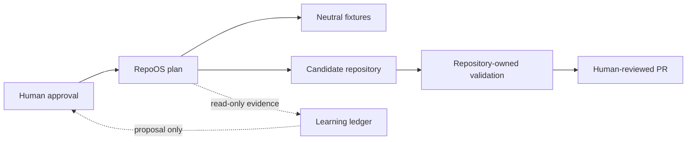

# Validated RepoOS architecture

Status: authoritative Phase 2 implementation plan
Validated: 2026-07-23

## Outcome

RepoOS is a small, deterministic control plane for inspecting, validating, planning, and—only after explicit approval—updating independently owned repositories. It is not a monorepo parent, runtime dependency, static template copier, autonomous agent service, or organization-governance controller.

The architecture keeps the Phase 1 four-layer model with local-evidence constraints:

1. **User-global Codex:** universal preferences and explicitly approved reusable assets. RepoOS may render, validate, diff, back up, and dry-run these components, but this run performs no home-directory installation.
2. **RepoOS control plane:** versioned schemas, component metadata, CLI, neutral fixtures, public-safe registry, learning records, and CI.
3. **Family/capability overlays:** ordered, versioned components with deterministic eligibility. None is created until at least two confirmed consumers exist.
4. **Repository-local:** product behavior, business rules, architecture, authoritative commands, secrets policy, local instructions, exceptions, and files not explicitly adopted.

Unknown ownership always resolves to repository-owned.

## Trust boundaries



- Discovery, inventory, validation, diff, audit, and reporting are read-only.
- A plan is data, not authorization.
- Apply requires an explicit repository, clean Git state, lock, fresh plan validation, backup, maximum-change limits, and an explicit execute switch.
- Apply never commits, pushes, opens a PR, merges, or changes GitHub settings.
- AI may summarize or propose; it cannot approve, enforce, apply, or promote.
- Downstream and user-global writes are separate authorization domains.

## Public/private evidence split

RepoOS is public. Committed registry and reports therefore use stable aliases, redacted private paths/remotes/SHAs, and publishability labels. Exact mappings, raw Git porcelain, logs, secrets, databases, and private project content remain local and ignored or outside the repository.

Redaction is part of the evidence pipeline, not a post-publication cleanup step. A record that cannot be proven public-safe is not committed.

## Version and state

- RepoOS follows SemVer beginning at `0.1.0`.
- YAML is used for reviewed desired state.
- JSON is used for generated locks, plans, reports, and deterministic evidence.
- JSONL may be used for append-only local ingestion later.
- Caches, locks, and operation journals live outside managed repositories by default.
- A repository declares desired adoption in `.repoos/project.yaml`.
- Update-plan schema v2 is immutable by canonical digest and binds the exact fixture path, common
  Git identity, HEAD, status, source root/files, target files, manifest, components, ownership,
  validation commands, and safety measurements.
- Transaction, backup, and public-safe observation schemas version operation state independently
  from the package. An adoption/release lock remains deferred until release artifact integrity and
  long-term rollback retention are implemented.

## Transaction boundary

Executable mutation in `0.2.0` is restricted to temporary or otherwise disposable Git repositories
containing a regular `.repoos-fixture` marker and a manifest that explicitly permits apply. A real
repository cannot become eligible merely by adding the marker; real adoption remains a separately
authorized ROS-011 workflow.

The deterministic state path is:

```text
planned → validated → locked → backed_up → applying → applied
        → validating → completed
                      ↘ rolling_back → rolled_back
                                      ↘ rollback_failed
```

Early failures terminate as `failed`. Invalid transitions are rejected. A schema-valid failed
attempt is recorded before target writes; dry-run creates neither transaction state nor target
state.

The engine holds a per-common-Git filesystem lock for the write/validation/rollback interval.
Process-visible metadata records PID, hostname, start time, target, transaction, and lock kind.
Stale or malformed locks are never removed implicitly; an explicit recovery flag preserves the
prior lock record before acquisition. A short-lived global lock serializes state-wide stale-lock
recovery without preventing ordinary operations on different fixtures.

Before the first target write, RepoOS creates and validates an atomically finalized backup beneath
the configured state directory. It contains the approved plan and manifest snapshots, transaction
metadata, target HEAD/status evidence, and only the original bytes/modes of paths in the plan.
Every snapshot and stored original is digest checked; apply also rebuilds the operation and safety
measurements from current source/target bytes rather than trusting recorded totals.
Validation failure automatically restores in reverse order. Manual rollback is backup-integrity
checked, lock protected, drift aware, and idempotent. `rollback_failed` is terminal to prevent an
uncontrolled retry loop.

Safety limits are part of the approved plan: files changed/created/deleted, bytes, lines, percentage
of repository files, allowed prefixes, forbidden patterns, and managed-section count. An exceeded
limit blocks before backup or target writes unless the exact named override is explicit and
recorded in the transaction.

## Ownership model

Initial support:

- fully managed files;
- generated files;
- repository-owned files;
- repository-owned extensions;
- explicit local overrides;
- excluded files.

Managed sections are supported only by the `0.2.0` fixture engine for UTF-8 text, one operation per
file, and exact unique whole-line start/end markers. Missing, duplicate, reversed, nested, or
overlapping boundaries fail closed. The plan separately binds the section and outside-byte hashes;
the renderer preserves marker lines, outside bytes, file mode, and existing LF/CRLF convention.
TOML, JSON, YAML, binary files, and real repositories are not eligible for section management.

## Minimum viable implementation

The current local implementation includes:

- explicit version and package metadata;
- public-safe project registry plus schema;
- manifest, observation, candidate, adoption, and update-plan schemas;
- deterministic CLI help, discovery, inventory, status, doctor, validation, diff, audit, update checking, planning, dry-run apply, and reporting;
- path containment, redaction, Git safety, pause, plan v2, process-visible locks, transaction
  records, atomic backups/writes, bounded validation, automatic restoration, and manual rollback
  exercised only on neutral fixtures;
- repaired RepoOS-local Codex surfaces;
- GitHub-hosted read-only CI pinned to full SHAs;
- neutral unit, integration, schema, security, and CLI fixtures;
- Git-tracked learning directories and recurring read-only workflow specifications.

## Explicitly deferred

- real family/capability overlays;
- user-global installation;
- release signing/publication and content-addressed baseline service;
- organization rulesets, required workflows, variables, secrets, apps, or runners;
- self-hosted runners;
- AI semantic review and automatic promotion;
- SQLite/service/API/dashboard/event bus/vector database;
- broad portfolio rollout;
- downstream canary writes until explicit confirmation.
- file deletion, force rollback, multi-section files, structured-file section management, and
  multi-repository transactions.

## Authority

This document supersedes repository-dependent assumptions in the Phase 1 packet. The schemas and shipped code control machine behavior; this document controls architecture; repository-local instructions control target-specific behavior.
