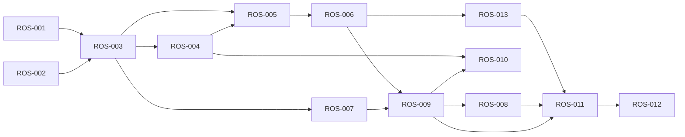

# Validated implementation backlog

Validated: 2026-07-23
Updated: 2026-07-25
Authority: local backlog only; no GitHub issues were created

## Dependency graph

This graph removes the Phase 1 ROS-001/ROS-003 cycle, makes real delivery depend on apply/rollback proof, and does not make scheduled learning a prerequisite for safe rollout.

## Common constraints

Every issue preserves unrelated work, keeps private evidence out of public artifacts, uses explicit
targets, rejects dirty/unsafe mutation, and makes no external write without separate authorization.
Disposable fixtures and synthetic real-repository worktrees are allowed for tests. Product support
for authorized manifest bootstrap does not authorize a portfolio write in this backlog run.

## ROS-001 — Validate Phase 1 and audit the supplied ZIP

- **Objective:** establish a complete traceable requirements baseline and safe template disposition before implementation.
- **Detailed scope:** read all 16 Phase 1 files; map every recommendation; hash, integrity-test, safely extract, inventory, and statically audit all 49 ZIP files; compare with RepoOS.
- **Out of scope:** executing bundled code, modifying the template, or using the future CLI to validate its own prerequisite.
- **Dependencies:** none.
- **Acceptance criteria:** 152 unique requirement IDs; ZIP hash/counts; traversal/type/duplicate checks; preserve/fix/replace/move decisions; contradictions recorded.
- **Files expected to change:** `reports/baseline/phase-1-validation-ledger.md`, `reports/baseline/template-divergence-report.md`.
- **Validation commands:** `rg ... | sort -u | wc -l`; `unzip -t`; archive metadata parser; `git diff --check`.
- **Risks:** executing untrusted archive content; losing source traceability.
- **Rollback:** delete only the generated reports on the isolated branch.
- **Parallelization group:** A0, read-only.
- **Execution wave:** 0.
- **Status:** completed locally.
- **Local evidence:** ZIP SHA-256 `7dc977d8663abe7209ba00f6ca784ecf6c773dbad1ee8191e527b2c8c5e4b486`; 49 safe regular entries; 152 ledger IDs.

## ROS-002 — Produce the public-safe portfolio baseline

- **Objective:** classify every first-level portfolio directory without leaking private project metadata.
- **Detailed scope:** read-only Git/filesystem safety inventory; public aliases; dirty/conditional/non-Git classification; bounded instruction-pattern audit; required Stage 1 reports.
- **Out of scope:** project scripts, builds, tests, hooks, fetches, lifecycle changes, or downstream writes.
- **Dependencies:** a minimal redaction rule established within the audit harness.
- **Acceptance criteria:** 14 roots accounted for; Git common-directory identity preserved; all 11 required baseline outputs; JSON parses; facts/inferences/unknowns distinguished.
- **Files expected to change:** `reports/baseline/*`.
- **Validation commands:** `jq empty reports/baseline/portfolio-inventory.json`; exact file-list check; `git diff --check`.
- **Risks:** confidentiality leakage; treating linked worktrees as separate repositories; invented commands.
- **Rollback:** remove generated public reports; local evidence remains outside RepoOS.
- **Parallelization group:** A0, read-only.
- **Execution wave:** 0.
- **Status:** completed locally.
- **Local evidence:** 14 directories, 7 working trees, 6 common Git directories, 4 dirty, 2 conditional, 1 safe candidate.

## ROS-003 — Establish the versioned Python foundation

- **Objective:** make RepoOS installable, versioned, deterministic, and truthful.
- **Detailed scope:** `0.1.0` version, `pyproject.toml`, package entry point, changelog, errors, canonical paths, redaction, reporting, state-root conventions.
- **Out of scope:** real overlays, external writes, release publication, database/service, or full candidate package tree.
- **Dependencies:** ROS-001 and ROS-002.
- **Acceptance criteria:** machine/human version agree; wheel/sdist build; `repoos --help`; stable error codes; state remains outside managed repositories; README reflects shipped behavior.
- **Files expected to change:** `VERSION`, `pyproject.toml`, `CHANGELOG.md`, `src/repoos/**`, `README.md`, `MEMORY.md`.
- **Validation commands:** `python -m build`; `python -m repoos --help`; version equality test; `pytest`.
- **Risks:** premature scaffolding and dependency burden.
- **Rollback:** remove the package files and restore documentation from Git.
- **Parallelization group:** A1, single writer for package metadata.
- **Execution wave:** 1.
- **Status:** completed locally for the `0.1.0` foundation.
- **Local evidence:** Python 3.13 is installed; existing RepoOS tooling is Python; no package metadata currently exists.

## ROS-004 — Add registry, manifest, learning, and plan schemas

- **Objective:** create deterministic contracts before behavioral implementation.
- **Detailed scope:** schemas for public-safe registry, repository manifest, observation, candidate, adoption, and update plan; valid/invalid examples; RepoOS registry entry; local-private overlay convention.
- **Out of scope:** downstream manifests, generated lock, real release artifacts, or confirmed family overlays.
- **Dependencies:** ROS-003.
- **Acceptance criteria:** unknown fields rejected; null/unknown/not-observed represented; cross-field constraints tested; public registry contains no private identifiers; RepoOS is the only unredacted entry.
- **Files expected to change:** `schemas/*.schema.json`, `registry/projects.yaml`, `examples/**`, `tests/schema/**`.
- **Validation commands:** `repoos validate --all`; `pytest tests/schema`; secret/path scan.
- **Risks:** schema overdesign; sensitive registry data.
- **Rollback:** remove schema/registry additions; no target state changes.
- **Parallelization group:** A2, schema owner.
- **Execution wave:** 1.
- **Status:** completed locally.
- **Local evidence:** public/private split is required; YAML/JSON file contracts are sufficient for the observed scale.

## ROS-005 — Implement read-only CLI and safety primitives

- **Objective:** provide deterministic discovery, inventory, status, doctor, validation, diff, audit, check, and report behavior.
- **Detailed scope:** explicit roots/targets; bounded traversal; Git common-dir identity; containment/symlink checks; redaction; pause; locks; structured JSON/human output; stable exits.
- **Out of scope:** real target apply, GitHub writes, recursive content mining, or command invention.
- **Dependencies:** ROS-003 and ROS-004.
- **Acceptance criteria:** all minimum read-only commands have useful help; JSON is deterministic; dirty state is classified; no-write snapshots pass; concurrent lock refusal and pause behavior pass.
- **Files expected to change:** `src/repoos/cli.py`, `discovery.py`, `git.py`, `locks.py`, `pause.py`, `validation.py`, `reporting.py`, related tests.
- **Validation commands:** CLI help/smoke matrix; `pytest tests/unit tests/integration tests/security`; repeat-output comparison.
- **Risks:** unbounded traversal, Git side effects, path escape, secret output.
- **Rollback:** revert package changes; no external state exists.
- **Parallelization group:** A2 after shared interfaces stabilize.
- **Execution wave:** 1.
- **Status:** completed locally for read-only and dry-run behavior.
- **Local evidence:** portfolio contains non-Git roots, linked worktrees, missing remotes, dirty trees, and complex worktree registries.

## ROS-006 — Implement fixture-only planning, apply, backup, and rollback

- **Objective:** prove update safety against disposable repositories before any canary.
- **Detailed scope:** deterministic fixture update planning and plan digest; fully managed,
  generated, and uniquely marked text-section operations; explicit preservation/refusal for
  repository-owned extensions, local overrides, and excluded files; immutable transaction
  records and state machine; process-visible global metadata and common-Git write locks; explicit
  stale-lock recovery; pre-write safety limits; approved-path-only atomic backups and writes;
  bounded repository validation; automatic restoration; explicit manual rollback; public-safe
  transaction observations; JSON/human CLI output and stable failure exits.
- **Out of scope:** every real portfolio write; repository adoption; commit, push, PR, or GitHub
  mutation; user-global installation; release publication; broad or multi-repository rollout;
  automatic learning promotion; structured-file section management; deletion in the initial
  executable engine; or any operation against an unmarked repository.
- **Dependencies:** ROS-005; ROS-004 schema conventions; ROS-009 neutral-fixture harness. A real
  canary continues to depend on ROS-008 and separate explicit authorization through ROS-011.
- **Acceptance criteria:** the plan binds repository identity/path fingerprint, planning HEAD and
  status fingerprint, manifest/update-plan/RepoOS versions, components, ownership modes, source
  and target hashes, managed-section boundaries, intended hashes, validation commands, and all
  safety measurements; canonical digest tampering or stale preconditions fail before target
  writes and still create a content-free failed-attempt record; invalid transaction transitions
  fail deterministically; global metadata locking and per-common-Git write locking permit safe
  concurrency across different fixtures while refusing same-target contention; stale and malformed
  locks require explicit recovery; an atomically finalized, integrity-checked backup exists before
  the first target write; only approved regular files beneath the fixture root are backed up or
  written; unsafe symlinks/traversal and unsupported ownership are refused; managed-section
  ambiguity or local inside/outside edits are refused; configurable conservative limits are
  enforced before writes and overrides are recorded; failure injection after every write/validation/
  rollback boundary proves stop-on-first-failure and byte-for-byte restoration; validation failure
  automatically rolls back; manual rollback is locked, integrity-checked, drift-aware, bounded,
  and idempotent; dry-run creates no target or transaction state; repeated apply is a no-op or
  deterministic refusal; transaction show/list and learning summaries contain no file contents,
  secret values, environment values, authentication data, or unbounded output; no Git mutation
  command is used.
- **Files expected to change:** `schemas/update-plan.schema.json`,
  `schemas/transaction.schema.json`, `schemas/backup-manifest.schema.json`,
  `schemas/transaction-observation.schema.json`, `src/repoos/planning.py`,
  `src/repoos/ownership.py`, `src/repoos/transactions.py`, `src/repoos/locks.py`,
  `src/repoos/backup.py`, `src/repoos/apply.py`, `src/repoos/cli.py`, fixture tests, and the
  authoritative architecture/operations/reference documentation.
- **Validation commands:** `make verify`; targeted schema, state-machine, managed-section, lock,
  failure-injection, automatic/manual rollback, byte-restoration, dry-run, idempotency, and CLI
  tests; installed-wheel command-surface smoke test; staged secret/private-path scan.
- **Risks:** partial writes, false atomicity, unsafe stale-lock recovery, backup corruption, marker
  ambiguity, rollback overreach, validation output leakage, and tests that accidentally target a
  real repository.
- **Rollback:** transaction backup restores only paths named by the approved fixture plan; files
  created by the transaction are removed and original modes/bytes are restored in reverse order;
  implementation code is reverted through Git without touching transaction fixtures.
- **Parallelization group:** A3, single mutation-path owner.
- **Execution wave:** 2.
- **Status:** completed locally on the isolated RepoOS branch; no real repository is eligible.
- **Local evidence:** Phase 1 promised atomicity without an algorithm; local dirty states require fail-closed behavior.

## ROS-007 — Repair RepoOS Codex surfaces

- **Objective:** replace unsupported or false active Codex infrastructure with current, tested contracts.
- **Detailed scope:** minimal config; selected TOML agents; current hook structure; tested guard behavior; valid executable rules or policy-only docs; skill boundary improvements; strict validators.
- **Out of scope:** propagation, user-global installation, speculative agents/skills, or broad blocking claims.
- **Dependencies:** ROS-003 and current official-schema evidence.
- **Acceptance criteria:** config allowlist passes; obsolete agent files gone/replaced; hook positive/negative fixtures; rule parser checks; skills retain required front matter; registry claims match behavior.
- **Files expected to change:** `.codex/**`, `.agents/skills/**`, `tools/agentops/**`, `docs/agentops/**`, tests.
- **Validation commands:** `repoos validate codex`; `codex execpolicy check`; hook process fixtures; `pytest tests/codex`.
- **Risks:** blocking legitimate commands or relying on undocumented behavior.
- **Rollback:** restore prior files from Git; remove active hook/rule references first if validation fails.
- **Parallelization group:** A2, Codex surface owner.
- **Execution wave:** 3.
- **Status:** completed locally.
- **Local evidence:** config custom tables, 10 Markdown agents, obsolete hook shape/no-op router, and prose rules are confirmed.

## ROS-008 — Establish safe GitHub workflow foundations

- **Objective:** make RepoOS CI portable, read-only, pinned, and representative of real validation.
- **Detailed scope:** GitHub-hosted CI; full-SHA action pins; least privilege; concurrency; timeout; package/test/lint/type/build/CLI commands; read-only scheduled audit specification.
- **Out of scope:** organization settings, required workflows, runner registration, secrets, downstream workflows, or PR automation.
- **Dependencies:** ROS-009 and ROS-007.
- **Acceptance criteria:** workflow syntax valid; pins verified against upstream commits; no self-hosted PR execution; no secrets/write permissions; CI-equivalent commands pass locally.
- **Files expected to change:** `.github/workflows/**`, workflow fixtures, runner/verification docs.
- **Validation commands:** YAML parse; workflow policy validator; exact local CI command; pin-origin verification.
- **Risks:** supply-chain pin mistakes and divergence between local/CI commands.
- **Rollback:** restore previous workflow only if safe; otherwise disable the new workflow through a follow-up commit.
- **Parallelization group:** A4 after test contract stabilizes.
- **Execution wave:** 3.
- **Status:** completed locally.
- **Local evidence:** RepoOS is public, no self-hosted runner is registered, and the current workflow uses mutable tags and a persistent Mac label set.

## ROS-009 — Build comprehensive neutral-fixture verification

- **Objective:** prove every shipped claim semantically, including negative behavior.
- **Detailed scope:** unit, integration, schema, security, CLI, migration/rollback, hook, rule, workflow, idempotency, interrupted-operation, symlink, worktree, non-Git, missing/multiple-remote fixtures.
- **Out of scope:** destructive tests in live repositories or canary CI.
- **Dependencies:** ROS-004, ROS-005, ROS-006, and ROS-007.
- **Acceptance criteria:** all requested fixture classes exist; tests fail on representative defects; build/lint/format/type/check/help/dry-run pass; coverage gaps are stated.
- **Files expected to change:** `tests/**`, `Makefile`, test config and fixtures.
- **Validation commands:** `make verify`; targeted negative-test invocations; build and installation smoke test.
- **Risks:** presence-only tests and unrepresentative fixtures.
- **Rollback:** remove defective tests only with a recorded test-defect explanation; product failures are not suppressed.
- **Parallelization group:** A3 with nonoverlapping fixture ownership.
- **Execution wave:** 2–3.
- **Status:** completed locally for shipped behavior—138 tests include executable fixture
  apply/rollback, failure injection, schemas, locks, CLI, Codex, and no-write evidence.
- **Local evidence:** current Make/test path performs shallow file-presence checks and has no `tests/` directory.

## ROS-010 — Establish the learning ledger and recurring read-only specs

- **Objective:** make evidence and decisions durable without adding a service or autonomous promotion.
- **Detailed scope:** observation/candidate/accepted/rejected/adoption directories; schemas/examples; deduplication key; publishability labels; daily/weekly/biweekly/monthly read-only workflow specs and pause behavior.
- **Out of scope:** AI service, database, automatic promotion, external event ingestion, long-running daemon, or schedule installation.
- **Dependencies:** ROS-004 and ROS-009.
- **Acceptance criteria:** valid/invalid records; state transitions require human fields; private evidence cannot enter public records; recurring jobs are read-only and idempotent.
- **Files expected to change:** `learning/**`, `docs/architecture/LEARNING_LOOP.md`, recurring workflow specs/tests.
- **Validation commands:** schema tests; duplicate fixture; redaction/publishability tests; repeated dry-run comparison.
- **Risks:** confidentiality leakage and process overhead.
- **Rollback:** remove unpublished records/specs; accepted/rejected history remains append-only once used.
- **Parallelization group:** A4.
- **Execution wave:** 4.
- **Status:** completed locally for the Git-tracked foundation and specifications.
- **Local evidence:** no measured evidence volume justifies AI or a database; Git-tracked decisions are sufficient.

## ROS-013 — Add guarded real-repository manifest bootstrap

- **Objective:** enable the smallest real-repository transaction: create one absent
  `.repoos/project.yaml` under exact local authorization.
- **Detailed scope:** separate immutable bootstrap plan/authorization schemas; strict fully
  materialized manifest validation; exact target/worktree/common-Git/branch/HEAD/plan/content
  binding; one-use expiring local receipt; content-free sibling classification; common-Git lock;
  absence-aware backup; exclusive atomic install; repository validation; automatic/manual
  idempotent rollback; public-safe transaction evidence; JSON/human CLI; installed-wheel proof.
- **Out of scope:** replacing a manifest; any other real-repository file; overlays/components;
  branch/ref/config/worktree mutation; commit/push/PR; GitHub/user-global changes; force/limit
  override; downstream testing or canary execution.
- **Dependencies:** ROS-006 transaction engine and ROS-009 synthetic harness.
- **Acceptance criteria:** one create/zero edits/deletes; existing/dirty/stale/unsafe targets fail;
  dirty sibling is protected without body reads or persisted names; ambiguous/drifting siblings
  fail; authorization cannot expire/replay/cross target/HEAD; target/siblings/common Git are
  preserved; rollback restores all pre-existing bytes/modes/state; general real updates remain
  refused; fixture behavior remains compatible.
- **Files expected to change:** bootstrap plan/authorization and extended transaction/backup
  schemas; Git topology, bootstrap, apply/rollback, ownership, CLI, verification, docs, and
  synthetic tests; version surfaces to `0.3.0`.
- **Validation commands:** `make verify`; format/lint/type/full Pytest; all-schema
  validation/doctor; offline build; installed-wheel fixture/bootstrap smoke; diff/private/secret
  scans.
- **Risks:** sibling-content disclosure, common-Git mutation, authorization replay, destination
  race, parent over-delete, rollback drift, and accidental general real-apply enablement.
- **Rollback:** implementation via Git; transaction rollback removes only its created manifest and
  an empty transaction-created parent.
- **Parallelization group:** A4, single transaction-path owner.
- **Execution wave:** prerequisite to ROS-011.
- **Status:** completed locally on the guarded-bootstrap branch using synthetic repositories only;
  the complete 192-test suite and installed-wheel fixture/bootstrap smoke pass; no downstream
  canary was performed.

## ROS-011 — Adopt the approved canary in two bounded proposals

- **Objective:** prove adoption, update, validation, review, and forward rollback in one real repository.
- **Detailed scope:** refresh P08 and GitHub `main`; preserve P08-W1/P08-W2; create a new isolated
  issue-linked worktree; obtain exact confirmation; manifest-only plan/dry-run/apply; repository
  checks; rollback rehearsal; separately approved reapplication and local commit. A later bounded
  component remains a separate proposal.
- **Out of scope:** other repositories, broad rollout, organization settings, automatic push/merge, or multiple components.
- **Dependencies:** ROS-008, ROS-009, completed ROS-013, explicit user authorization, and a newly
  created clean/trustworthy P08 worktree from revalidated current `main`.
- **Acceptance criteria:** approved identity/risk/commands/family/ownership; clean state; reviewed diffs; checks pass; post-adoption plan no-op; forward rollback demonstrated.
- **Files expected to change:** first proposal: P08 `.repoos/project.yaml` only. Any component or
  RepoOS adoption record is a later separately approved proposal.
- **Validation commands:** exact P08 commands only after user confirmation; RepoOS plan/apply/rollback checks.
- **Risks:** touching P08-W1/P08-W2, stale base, behavior regression, private metadata leakage,
  authorization reuse, or widening beyond the fixed destination.
- **Rollback:** automatic/manual transaction rollback before commit; any later committed recovery
  requires a separately approved forward proposal.
- **Parallelization group:** A5, single downstream writer.
- **Execution wave:** 4.
- **Status:** blocked for downstream execution—engine prerequisite is complete, but the later run
  must revalidate live state, create the isolated worktree, and obtain execute/reapply/commit
  approvals.
- **Local evidence:** the
  [2026-07-23 readiness packet](../../reports/canary-readiness/2026-07-23/README.md) confirms two
  current P08 worktrees and zero prunable records. P08-W2 contains active or potentially active
  untracked implementation work and is preserved in place without body inspection; P08-W1 is also
  unchanged. RepoOS `0.3.0` can protect dirty siblings while operating only in a new clean target.

## ROS-012 — Govern broad rollout and high-authority extensions

- **Objective:** expand only after the canary proves value, safety, update, and rollback.
- **Detailed scope:** one explicit proposal per repository; adoption/defer/exclude state; release artifact integrity/retention; optional global installer; optional GitHub governance; optional scheduled learning after measured need.
- **Out of scope:** bulk autonomous migration, force push, auto-merge, silent settings mutation, or one-size-fits-all overlays.
- **Dependencies:** successful ROS-011 and separate authorization for each mutation class. ROS-010 scheduling is optional, not a hard dependency.
- **Acceptance criteria:** every target classified; clean state; accepted ownership; limits; review/rollback; maintenance benefit measured; high-authority actions have separate plans.
- **Files expected to change:** future repository-specific issues and explicitly approved RepoOS release/governance files.
- **Validation commands:** per-repository commands, release integrity/offline restore, settings before/after comparison where authorized.
- **Risks:** centralization overriding autonomy, review overload, artifact loss, privilege expansion.
- **Rollback:** pause rollout; forward rollback proposals; restore settings from exported prior state.
- **Parallelization group:** A6, one mutation at a time.
- **Execution wave:** 5+.
- **Status:** deferred.
- **Local evidence:** four dirty trees, two conditional trees, seven non-Git roots, and no approved canary make broad rollout unsafe.
